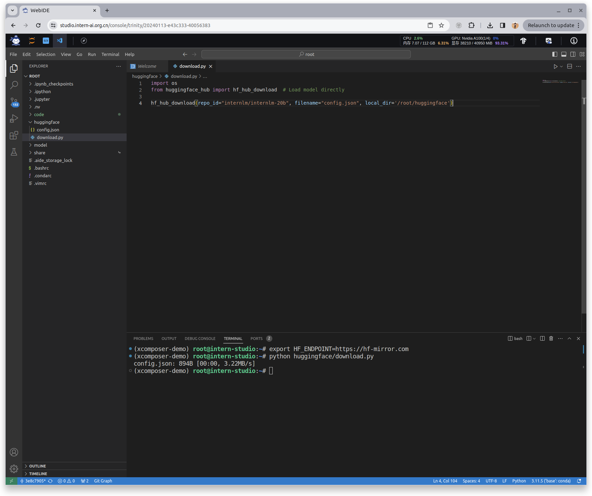
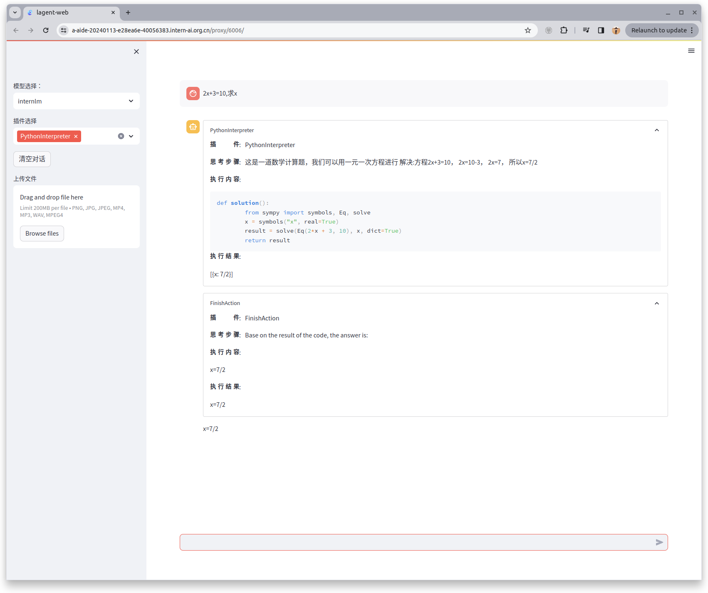
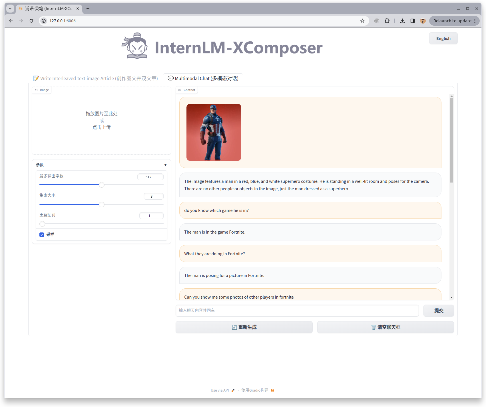

# 轻松玩转书生·浦语大模型趣味 Demo

1. 大模型及 InternLM 模型介绍

* 利用大量数据进行训练
* 拥有数十亿甚至数千亿个参数
* 模型在各种任务重展现出惊人的性能

2. InternLM-Chat-7B 智能对话 Demo

通过单一的代码库，InternLM支持在拥有数千个GPU的大型集群上进行预训练，并在单个GPU上进行微调，同时实现了卓越的性能优化。在1024个GPU上训练时，InternLM可以实现近90%的加速效率。
InternLM-7B包含了一个拥有70亿参数的基础模型和一个为实际场景量身定制的对话模型。该模型具有以下特点：

利用数万亿的高质量token进行训练，建立了一个强大的知识库。
支持8k token的上下文窗口长度，使得输入序列更长并增强了推理能力。

3. Lagent 智能体工具调用 Demo

Lagent介绍
Lagent是一个轻量级、开源的给予大语言模型的智能体（agent）框架，用户可以快速地将一个大语言模型转变为多种类型的智能体，并提供了一些典型工具为大语言模型赋能。

4. 浦语·灵笔图文创作理解 Demo

浦语·灵笔是基于书生·浦语大语言模型研发的视觉-语言大模型，提供出色的图文理解和创作能力，具有多项优势：

为用户打造图文并茂的专属文章。
设计了高效的训练策略，为模型注入海量的多模态概念和知识数据，赋予其强大的图文理解和对话能力。

5. 通用环境配置

pip、conda换源
pip换源设置 pip默认镜像源，升级pip到最新的版本（》=10.0.0）后进行配置，如下所示：
```bash
python -m pip install --upgrade pip
pip config set global.index-url https://mirrors.cernet.edu.cn/pypi/web/simple
```

conda快速换源
```cpp
cat <<'EOF' > ~/.condarc
channels:
  - defaults
show_channel_urls: true
default_channels:
  - https://mirrors.tuna.tsinghua.edu.cn/anaconda/pkgs/main
  - https://mirrors.tuna.tsinghua.edu.cn/anaconda/pkgs/r
  - https://mirrors.tuna.tsinghua.edu.cn/anaconda/pkgs/msys2
custom_channels:
  conda-forge: https://mirrors.tuna.tsinghua.edu.cn/anaconda/cloud
  pytorch: https://mirrors.tuna.tsinghua.edu.cn/anaconda/cloud
EOF
```

HuggingFace 下载使用
HuggingFace官方提供的huggingface-cli命令行工具。
安装依赖：
```bash
pip install -U huggingface_hub
huggingface-cli download --resume-download internlm/internlm-chat-7b --local-dir your_path
```

模型下载
OpenXLab 可以通过指定模型仓库的地址，以及需要下载的文件的名称，文件所需下载的位置等，直接下载模型权重文件。使用python脚本下载模型首先要安装依赖，安装代码如下：pip install -U openxlab 安装完成后使用 download 函数导入模型中心的模型。
将以下代码写入Python文件，运行即可。

```python
from openxlab.model import download
download(model_repo='OpenLMLab/InternLM-7b', model_name='InternLM-7b', output='your local path')
```

```bash
pip install modelscope
pip install transformers
```


在当前目录下载新建python文件，填入以下代码，运行即可。

```python
import torch
from modelscope import snapshot_download, AutoModel, AutoTokenizer
import os
model_dir = snapshot_download('Shanghai_AI_Laboratory/internlm-chat-7b', cache_dir='your path', revision='master')
```


## 4个Demo实际操作

1. 在实操前我们需要对部署大模型应用有一个大概的了解，首先我们需要有算力，这里以InternStudio为例，如果您的账号没有算力请报名书生·浦语大模型实战营第二期。如下图，笔者已经在 InternStudio 平台创建了开发机并配置了 SSH 连接。


2. 其次，我们需要创建 conda 环境，并安装 python 依赖：

```bash
bash # 请每次使用 jupyter lab 打开终端时务必先执行 bash 命令进入 bash 中
conda create --name internlm-demo --clone=/root/share/conda_envs/internlm-base # 创建conda环境
conda activate internlm-demo # 激活conda环境

# 升级pip
python -m pip install --upgrade pip

pip install modelscope==1.9.5
pip install transformers==4.35.2
pip install streamlit==1.24.0
pip install sentencepiece==0.1.99
pip install accelerate==0.24.1
pip install transformers==4.33.1 timm==0.4.12 sentencepiece==0.1.99 gradio==3.44.4 markdown2==2.4.10 xlsxwriter==3.1.2 einops accelerate

```

接着我们还需要下载模型,开发机里提供了一些预先下载好的模型，我们只需拷贝即可使用：

```bash
mkdir -p /root/model/Shanghai_AI_Laboratory
cp -r /root/share/temp/model_repos/internlm-chat-7b /root/model/Shanghai_AI_Laboratory

cp -r /root/share/temp/model_repos/internlm-xcomposer-7b /root/model/Shanghai_AI_Laboratory

```

当然也可以使用HuggingFace、ModelScope 或者OpenXLab 下载，如MOdelScope下载internlm-chat-7b:


```bash
import torch
from modelscope import snapshot_download, AutoModel, AutoTokenizer
import os
model_dir = snapshot_download('Shanghai_AI_Laboratory/internlm-chat-7b', cache_dir='/root/model', revision='v1.0.3')
```


### InternLM-Chat智能对话Demo

通过这个Demo，我们通过 steamlit 的方式运行基于 InternLM-Chat-7B 模型的智能对话机器人。

代码准备：

```bash
cd /root/code
git clone https://gitee.com/internlm/InternLM.git
```

修改 /root/code/InternLM/web_demo.py 中模型的路径，替换为本地路径，接着运行 Demo：

```bash
streamlit run web_demo.py --server.address 127.0.0.1 --server.port 6006
```


* Familiar with hugging face function, use `huggingface_hub python` to download `InternLM-20B` and `config.json`




### Lagent智能体工具调用Demo

通过书生·浦语大模型开源开发全链路体系中应用(智能体)Lagent 实现能解数学题的Demo

代码准备：
```bash
cd /root/code
git clone https://gitee.com/internlm/lagent.git
cd /root/code/lagent
pip install -e . # 源码安装Lagent
```

修改 /root/code/lagent/examples/react_web_demo.py，主要是替换 init_model方法中模型路径，action_list移除GoogleSearch() 接着运行命令：

```bash
streamlit run /root/code/lagent/examples/react_web_demo.py --server.address 127.0.0.1 --server.port 6006
```



### 浦语·灵笔图文理解创作 Demo 1

通过internlm-xcomposer-7b 模型部署一个图文理解创作 Demo ，能够理解图片信息、能够创作图文长篇文章等。

代码准备：


```bash
cd /root/code
git clone https://gitee.com/internlm/InternLM-XComposer.git
```

代码运行：

```bash
cd /root/code/InternLM-XComposer
python examples/web_demo.py  \
    --folder /root/model/Shanghai_AI_Laboratory/internlm-xcomposer-7b \
    --num_gpus 1 \
    --port 6006
```



### 浦语·灵笔图文理解创作 Demo 2


参考下面生成的文章

* [又见法兰克福](images/io.md)