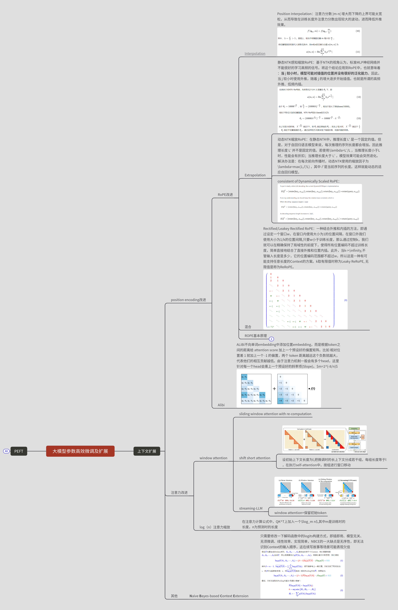
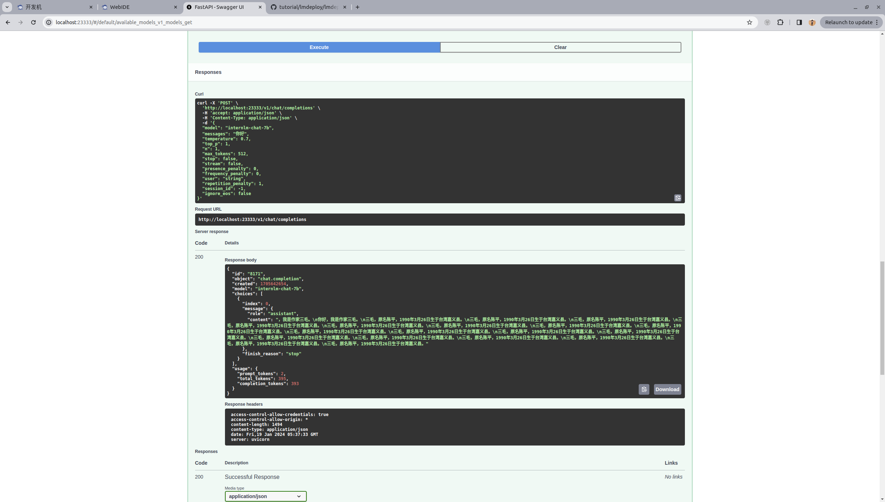
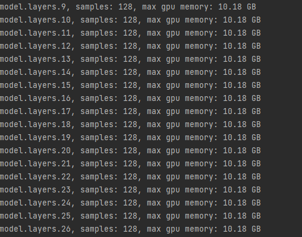
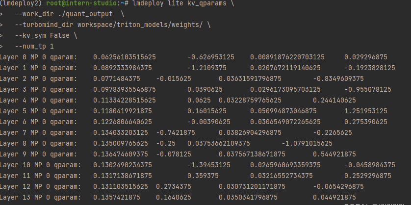

# LMDeploy 大模型量化部署实践 学习笔记

* 视频教程链接：
https://www.bilibili.com/video/BV1iW4y1A77P

* 文档链接：
https://github.com/InternLM/tutorial/blob/main/lmdeploy/lmdeploy.md

* 大模型上下文扩展技术原理




## 大模型部署的背景
* 模型部署：将训练好的模型在特定的软硬件环境中启动，使模型能够接收输入并返回预测结果。为了满足性能和效率的需求，常常要对模型进行优化，例如模型压缩和硬件加速。

* 大模型的特点：内存开销巨大，参数量庞大，7B模型仅权重就需要14G内存。采用自回归生成token，需要缓存Attention的k/v。动态shape，请求数不固定，token逐个生成，且数量不定。相对视觉模型，LLM结构简单，Transformers结构大部分是decoder-only。

大模型部署挑战：

* 设备：如何应对巨大的存储问题？低存储设备，消费级显卡，手机等如何部署？
* 推理：如何加速token的生成，如何解决动态shape，让推理可以不间断，如何有效管理和利用内存。
* 服务：如何提升系统吞吐量，降低响应时间。

* 部署方案：

## LMDeploy简介
LMDeploy是LLM在英伟达设备上部署的全流程解决方案。包括轻量化，推理和服务。提供了高效的推理引擎和完备易用的工具链。

* 核心功能：

* 量化

* 推理引擎TurboMind

* 推理服务api server

## 项目实战\

* 环境准备
```python
/root/share/install_conda_env_internlm_base.sh lmdeploy
conda activate lmdeploy
```

* 安装LMDeploy

```bash
pip install 'lmdeploy[all]==v0.1.0'
```
* 离线转换

```bash
lmdeploy convert internlm-chat-7b  /root/share/temp/model_repos/internlm-chat-7b/
```

* 模型部署

方案1.命令行
```bash 
lmdeploy chat turbomind ./workspace
```


方案2. API服务




```bash
# ApiServer+Turbomind   api_server => AsyncEngine => TurboMind
lmdeploy serve api_server ./workspace \
	--server_name 0.0.0.0 \
	--server_port 23333 \
	--instance_num 64 \
	--tp 1

lmdeploy serve api_client http://localhost:23333
```

方案3.gradio


```bash
# Gradio+ApiServer。必须先开启 Server，此时 Gradio 为 Client
lmdeploy serve gradio http://0.0.0.0:23333 \
	--server_name 0.0.0.0 \
	--server_port 6006 \
	--restful_api True
  
  lmdeploy serve gradio ./workspace
```

方案4. TurboMind 推理 + Python 代码集成

```bash
from lmdeploy import turbomind as tm

# load model
model_path = "/root/share/temp/model_repos/internlm-chat-7b/"
tm_model = tm.TurboMind.from_pretrained(model_path, model_name='internlm-chat-20b')
generator = tm_model.create_instance()

# process query
query = "你好啊兄嘚"
prompt = tm_model.model.get_prompt(query)
input_ids = tm_model.tokenizer.encode(prompt)

# inference
for outputs in generator.stream_infer(
        session_id=0,
        input_ids=[input_ids]):
    res, tokens = outputs[0]

response = tm_model.tokenizer.decode(res.tolist())
print(response)
```


## 模型量化

那么，如何优化 LLM 模型推理中的访存密集问题呢？ 我们可以使用 KV Cache 量化和 4bit Weight Only 量化（W4A16）。KV Cache 量化是指将逐 Token（Decoding）生成过程中的上下文 K 和 V 中间结果进行 INT8 量化（计算时再反量化），以降低生成过程中的显存占用。4bit Weight 量化，将 FP16 的模型权重量化为 INT4，Kernel 计算时，访存量直接降为 FP16 模型的 1/4，大幅降低了访存成本。Weight Only 是指仅量化权重，数值计算依然采用 FP16（需要将 INT4 权重反量化）。

### KV Cache 量化

```bash
# 第一步：计算 minmax
lmdeploy lite calibrate \
  --model  /root/share/temp/model_repos/internlm-chat-7b/ \
  --calib_dataset "c4" \
  --calib_samples 128 \
  --calib_seqlen 2048 \
  --work_dir ./quant_output
```
第一步：计算 minmax。主要思路是通过计算给定输入样本在每一层不同位置处计算结果的统计情况。




* 对于 Attention 的 K 和 V：取每个 Head 各自维度在所有Token的最大、最小和绝对值最大值。对每一层来说，上面三组值都是 (num_heads, head_dim) 的矩阵。这里的统计结果将用于本小节的 KV Cache。

* 对于模型每层的输入：取对应维度的最大、最小、均值、绝对值最大和绝对值均值。每一层每个位置的输入都有对应的统计值，它们大多是 (hidden_dim, ) 的一维向量，当然在 FFN 层由于结构是先变宽后恢复，因此恢复的位置维度并不相同。这里的统计结果用于下个小节的模型参数量化，主要用在缩放环节（回顾PPT内容）。


```bash
x lmdeploy lite calibrate \  --model  /root/share/temp/model_repos/internlm-chat-7b/ \  --calib_dataset "c4" \  --calib_samples 128 \  --calib_seqlen 2048 \  --work_dir ./quant_output
```


在这个命令行中，会选择 128 条输入样本，每条样本长度为 2048，数据集选择 C4，输入模型后就会得到上面的各种统计值。值得说明的是，如果显存不足，可以适当调小 samples 的数量或 sample 的长度。

第二步：通过 minmax 获取量化参数。主要就是利用下面这个公式，获取每一层的 K V 中心值（zp）和缩放值（scale）。

```bash
# 第二步：获取量化参数
zp = (min+max) / 2
scale = (max-min) / 255
quant: q = round( (f-zp) / scale)
dequant: f = q * scale + zp

# 修改 weights/config.ini 文件

```

有这两个值就可以进行量化和解量化操作了。具体来说，就是对历史的 K 和 V 存储 quant 后的值，使用时在 dequant。

```bash
# 通过 minmax 获取量化参数
lmdeploy lite kv_qparams \
  --work_dir ./quant_output  \
  --turbomind_dir workspace/triton_models/weights/ \
  --kv_sym False \
  --num_tp 1

```



第三步：修改配置。也就是修改 weights/config.ini 文件，这个我们在《2.6.2 模型配置实践》中已经提到过了（KV int8 开关），只需要把 quant_policy 改为 4 即可

### W4A16量化

```bash
# 第二步：量化权重模型
lmdeploy lite auto_awq \
  --model  /root/share/temp/model_repos/internlm-chat-7b/ \
  --w_bits 4 \
  --w_group_size 128 \
  --work_dir ./quant_output 

# 转换成 TurboMind 格式
# 转换模型的layout，存放在默认路径 ./workspace 下
lmdeploy convert  internlm-chat-7b ./quant_output \
    --model-format awq \
    --group-size 128

```

通过比较未使用量化&使用量化 


显存明显下降