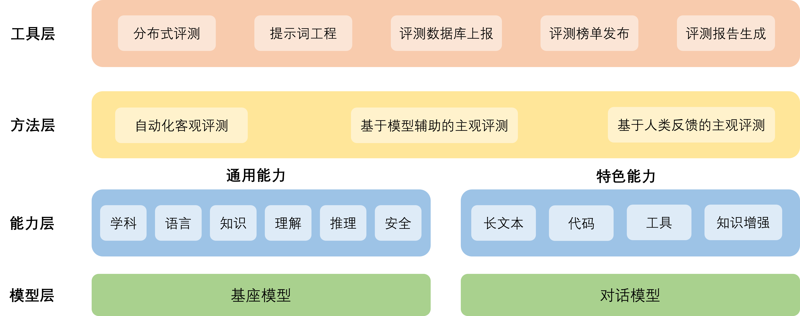

# 基于 OpenCompass 的大模型评测

## 评测对象
主要评测对象为语言大模型与多模态大模型:

基座模型：一般是经过海量的文本数据以自监督学习的方式进行训练获得的模型（如OpenAI的GPT-3，Meta的LLaMA），往往具有强大的文字续写能力。
对话模型：一般是在的基座模型的基础上，经过指令微调或人类偏好对齐获得的模型（如OpenAI的ChatGPT、上海人工智能实验室的书生·浦语），能理解人类指令，具有较强的对话能力。


## 工具架构

* 模型层：大模型评测所涉及的主要模型种类，OpenCompass以基座模型和对话模型作为重点评测对象。
* 能力层：OpenCompass从本方案从通用能力和特色能力两个方面来进行评测维度设计。在模型通用能力方面，从语言、知识、理解、推理、安全等多个能力维度进行评测。在特色能力方面，从长文本、代码、工具、知识增强等维度进行评测。
* 方法层：OpenCompass采用客观评测与主观评测两种评测方式。客观评测能便捷地评估模型在具有确定答案（如选择，填空，封闭式问答等）的任务上的能力，主观评测能评估用户对模型回复的真实满意度，OpenCompass采用基于模型辅助的主观评测和基于人类反馈的主观评测两种方式。
* 工具层：OpenCompass提供丰富的功能支持自动化地开展大语言模型的高效评测。包括分布式评测技术，提示词工程，对接评测数据库，评测榜单发布，评测报告生成等诸多功能



## 能力维度
通用能力涵盖学科综合能力、知识能力、语言能力、理解能力、推理能力、安全能力，共计六大维度构造立体全面的模型能力评价体系。

## 评测方法
OpenCompass采取客观评测与主观评测相结合的方法。针对具有确定性答案的能力维度和场景，通过构造丰富完善的评测集，对模型能力进行综合评价。针对体现模型能力的开放式或半开放式的问题、模型安全问题等，采用主客观相结合的评测方式。

## 客观评测
针对具有标准答案的客观问题，我们可以我们可以通过使用定量指标比较模型的输出与标准答案的差异，并根据结果衡量模型的性能。同时，由于大语言模型输出自由度较高，在评测阶段，我们需要对其输入和输出作一定的规范和设计，尽可能减少噪声输出在评测阶段的影响，才能对模型的能力有更加完整和客观的评价。

为了更好地激发出模型在题目测试领域的能力，并引导模型按照一定的模板输出答案，OpenCompass采用提示词工程 （prompt engineering）和语境学习（in-context learning）进行客观评测。

在客观评测的具体实践中，我们通常采用下列两种方式进行模型输出结果的评测：

判别式评测：该评测方式基于将问题与候选答案组合在一起，计算模型在所有组合上的困惑度（perplexity），并选择困惑度最小的答案作为模型的最终输出。例如，若模型在 问题? 答案1 上的困惑度为 0.1，在 问题? 答案2 上的困惑度为 0.2，最终我们会选择 答案1 作为模型的输出。
生成式评测：该评测方式主要用于生成类任务，如语言翻译、程序生成、逻辑分析题等。具体实践时，使用问题作为模型的原始输入，并留白答案区域待模型进行后续补全。我们通常还需要对其输出进行后处理，以保证输出满足数据集的要求。

## 主观评测
语言表达生动精彩，变化丰富，大量的场景和能力无法凭借客观指标进行评测。针对如模型安全和模型语言能力的评测，以人的主观感受为主的评测更能体现模型的真实能力，并更符合大模型的实际使用场景。

OpenCompass采取的主观评测方案是指借助受试者的主观判断对具有对话能力的大语言模型进行能力评测。在具体实践中，我们提前基于模型的能力维度构建主观测试问题集合，并将不同模型对于同一问题的不同回复展现给受试者，收集受试者基于主观感受的评分。由于主观测试成本高昂，本方案同时也采用使用性能优异的大语言模拟人类进行主观打分。在实际评测中，本文将采用真实人类专家的主观评测与基于模型打分的主观评测相结合的方式开展模型能力评估。

在具体开展主观评测时，OpenComapss采用单模型回复满意度统计和多模型满意度比较两种方式开展具体的评测工作。

## 评测流程


在 OpenCompass 中评估一个模型通常包括以下几个阶段：配置 -> 推理 -> 评估 -> 可视化。

* 配置：这是整个工作流的起点。您需要配置整个评估过程，选择要评估的模型和数据集。此外，还可以选择评估策略、计算后端等，并定义显示结果的方式。
* 推理与评估：在这个阶段，OpenCompass 将会开始对模型和数据集进行并行推理和评估。推理阶段主要是让模型从数据集产生输出，而评估阶段则是衡量这些输出与标准答案的匹配程度。这两个过程会被拆分为多个同时运行的“任务”以提高效率，但请注意，如果计算资源有限，这种策略可能会使评测变得更慢。
* 可视化：评估完成后，OpenCompass 将结果整理成易读的表格，并将其保存为 CSV 和 TXT 文件。你也可以激活飞书状态上报功能，此后可以在飞书客户端中及时获得评测状态报告。

接下来，我们将展示 OpenCompass 的基础用法，展示书生浦语在 C-Eval 基准任务上的评估。它们的配置文件可以在 configs/eval_demo.py 中找到。

所有命令均在jupyter notebook中执行

```bash
dataset                                         version    metric         mode      opencompass.models.huggingface.HuggingFace_model_repos_internlm-chat-7b
----------------------------------------------  ---------  -------------  ------  -------------------------------------------------------------------------
ceval-computer_network                          db9ce2     accuracy       gen                        31.58
ceval-operating_system                          1c2571     accuracy       gen                        36.84
ceval-computer_architecture                     a74dad     accuracy       gen                        28.57
ceval-college_programming                       4ca32a     accuracy       gen                        32.43
ceval-college_physics                           963fa8     accuracy       gen                        26.32
ceval-college_chemistry                         e78857     accuracy       gen                        16.67
ceval-advanced_mathematics                      ce03e2     accuracy       gen                        21.05
ceval-probability_and_statistics                65e812     accuracy       gen                        38.89
ceval-discrete_mathematics                      e894ae     accuracy       gen                        18.75
ceval-electrical_engineer                       ae42b9     accuracy       gen                        35.14
ceval-metrology_engineer                        ee34ea     accuracy       gen                        50
ceval-high_school_mathematics                   1dc5bf     accuracy       gen                        22.22
ceval-high_school_physics                       adf25f     accuracy       gen                        31.58
ceval-high_school_chemistry                     2ed27f     accuracy       gen                        15.79
ceval-high_school_biology                       8e2b9a     accuracy       gen                        36.84
ceval-middle_school_mathematics                 bee8d5     accuracy       gen                        26.32
ceval-middle_school_biology                     86817c     accuracy       gen                        61.9
ceval-middle_school_physics                     8accf6     accuracy       gen                        63.16
ceval-middle_school_chemistry                   167a15     accuracy       gen                        60
ceval-veterinary_medicine                       b4e08d     accuracy       gen                        47.83
ceval-college_economics                         f3f4e6     accuracy       gen                        41.82
ceval-business_administration                   c1614e     accuracy       gen                        33.33
ceval-marxism                                   cf874c     accuracy       gen                        68.42
ceval-mao_zedong_thought                        51c7a4     accuracy       gen                        70.83
ceval-education_science                         591fee     accuracy       gen                        58.62
ceval-teacher_qualification                     4e4ced     accuracy       gen                        70.45
ceval-high_school_politics                      5c0de2     accuracy       gen                        26.32
ceval-high_school_geography                     865461     accuracy       gen                        47.37
ceval-middle_school_politics                    5be3e7     accuracy       gen                        52.38
ceval-middle_school_geography                   8a63be     accuracy       gen                        58.33
ceval-modern_chinese_history                    fc01af     accuracy       gen                        73.91
ceval-ideological_and_moral_cultivation         a2aa4a     accuracy       gen                        63.16
ceval-logic                                     f5b022     accuracy       gen                        31.82
ceval-law                                       a110a1     accuracy       gen                        25
ceval-chinese_language_and_literature           0f8b68     accuracy       gen                        30.43
ceval-art_studies                               2a1300     accuracy       gen                        60.61
ceval-professional_tour_guide                   4e673e     accuracy       gen                        62.07
ceval-legal_professional                        ce8787     accuracy       gen                        39.13
ceval-high_school_chinese                       315705     accuracy       gen                        63.16
ceval-high_school_history                       7eb30a     accuracy       gen                        70
ceval-middle_school_history                     48ab4a     accuracy       gen                        59.09
ceval-civil_servant                             87d061     accuracy       gen                        53.19
ceval-sports_science                            70f27b     accuracy       gen                        52.63
ceval-plant_protection                          8941f9     accuracy       gen                        59.09
ceval-basic_medicine                            c409d6     accuracy       gen                        47.37
ceval-clinical_medicine                         49e82d     accuracy       gen                        40.91
ceval-urban_and_rural_planner                   95b885     accuracy       gen                        45.65
ceval-accountant                                002837     accuracy       gen                        26.53
ceval-fire_engineer                             bc23f5     accuracy       gen                        22.58
ceval-environmental_impact_assessment_engineer  c64e2d     accuracy       gen                        64.52
ceval-tax_accountant                            3a5e3c     accuracy       gen                        34.69
ceval-physician                                 6e277d     accuracy       gen                        40.82
ceval-stem                                      -          naive_average  gen                        35.09
ceval-social-science                            -          naive_average  gen                        52.79
ceval-humanities                                -          naive_average  gen                        52.58
ceval-other                                     -          naive_average  gen                        44.36
ceval-hard                                      -          naive_average  gen                        23.91
ceval                                           -          naive_average  gen                        44.16
01/21 21:57:14 - OpenCompass - INFO - write summary to /root/opencompass/outputs/default/20240121_204929/summary/summary_20240121_204929.txt
01/21 21:57:14 - OpenCompass - INFO - write csv to /root/opencompass/outputs/default/20240121_204929/summary/summary_20240121_204929.csv


```
## 进阶作业

使用 OpenCompass 评测 InternLM2-Chat-7B 模型使用 LMDeploy 0.2.0 部署后在 C-Eval 数据集上的性能
模型转换和部署


```bash
conda activate opencompass
pip install lmdeploy==0.2.0
 
lmdeploy convert internlm2-chat-7b /root/share/model_repos/internlm2-chat-7b --dst-path /root/ws_lmdeploy2.0
 
cd /root/opencompass
 
cd configs
#新建eval_internlm2-7b-deploy2.0.py
 
python run.py configs/eval_internlm2-7b-deploy2.0.py --debug --num-gpus 1
```

```python
from mmengine.config import read_base
from opencompass.models.turbomind import TurboMindModel
 
with read_base():
    # choose a list of datasets   
    from .datasets.ceval.ceval_gen_5f30c7 import ceval_datasets 
    # and output the results in a choosen format
    from .summarizers.medium import summarizer
 
datasets = sum((v for k, v in locals().items() if k.endswith('_datasets')), [])
 
internlm_meta_template = dict(round=[
    dict(role='HUMAN', begin='<|User|>:', end='\n'),
    dict(role='BOT', begin='<|Bot|>:', end='<eoa>\n', generate=True),
],
                              eos_token_id=103028)
 
# config for internlm2-chat-7b
internlm2_chat_7b = dict(
        type=TurboMindModel,
        abbr='internlm2-chat-7b-turbomind',
        path="/root/ws_lmdeploy2.0",
        engine_config=dict(session_len=2048,
                           max_batch_size=32,
                           rope_scaling_factor=1.0),
        gen_config=dict(top_k=1,
                        top_p=0.8,
                        temperature=1.0,
                        max_new_tokens=100),
        max_out_len=100,
        max_seq_len=2048,
        batch_size=32,
        concurrency=32,
        run_cfg=dict(num_gpus=1, num_procs=1),
    )
 
models = [internlm2_chat_7b]

```